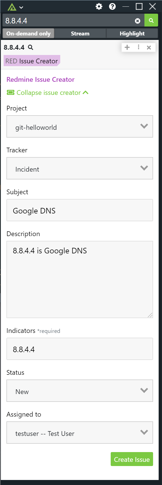

# Polarity Redmine Issue Creator Integration

The Polarity - Redmine Issue Creator integration lets you create new issue in Redmine from the overlay window based off an indicator on your screen.  The integration supports creating issues based off of IP addresses, hashes, urls, domains, emails and MAC addresses. To create a new issue, highlight an indicator on your screen and trigger an on-demand search.  This will open the Redmine Issue Creator integration where you will be able to install  

|  |
|---|
|*Redmine Issue Creator* | 

To learn more about Redmine, please visit the [official website](https://www.redmine.org/).

## Configuring Redmine

For this integration to work, you must enable the REST API in Redmine.  To do this, you have to check `Enable REST web service` under Administration -> Settings -> API.

## Redmine Integration Options

### Redmine Server URL

The URL for your Redmine instance to include the schema (i.e., https://) and port (e.g., https://redmine:8080) as necessary

### Redmine Administrator REST API Key

A REST API Key for your Redmine administrator. This key is used to retrieve user, status, project, and tracker information when the integration first starts. The Admin API Key is not used for creating issues. 
 
> Please restart the integration after modifying this option. 

> This option should be set to "Only admins can view and edit"

### Redmine User REST API Key

The REST API Key used to authenticate to your Redmine instance.  The user associated with this key will be the creator of the new issue.  

> This option should be set to "Users can view and edit".

### Default Project Name

The default project to create your new issue in. The project name is case sensitive.

### Default Tracker Name

The default tracker type for your new issue (e.g., Bug, Support, Incident). The tracker name is case sensitive.

### Default Status Name

The default status type for your new issue (e.g., New, In Progress, Resolved). The status name is case sensitive.

### Default Assignee Login

The default assignee for your new issue. You should specify a user's login for this option. The login value is case sensitive.

## Polarity

Polarity is a memory-augmentation platform that improves and accelerates analyst decision making. For more information about the Polarity platform please see:

https://polarity.io/
